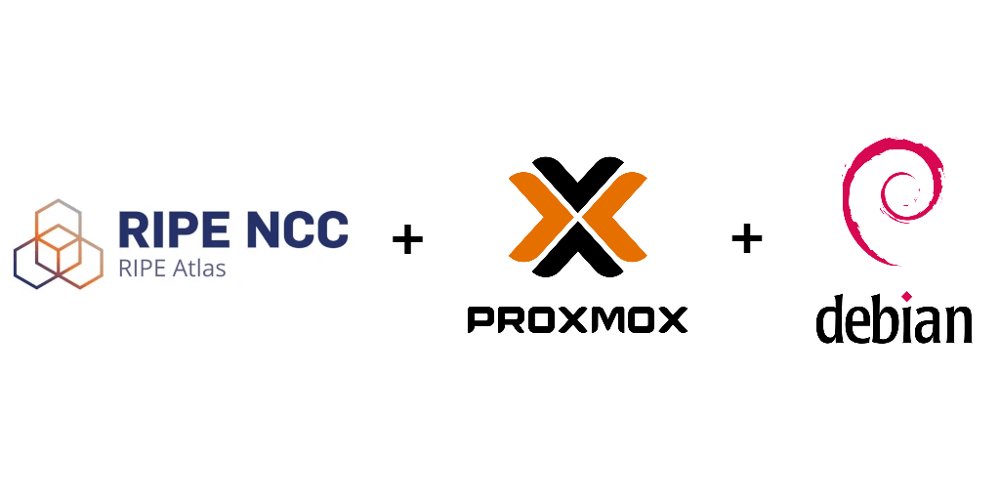
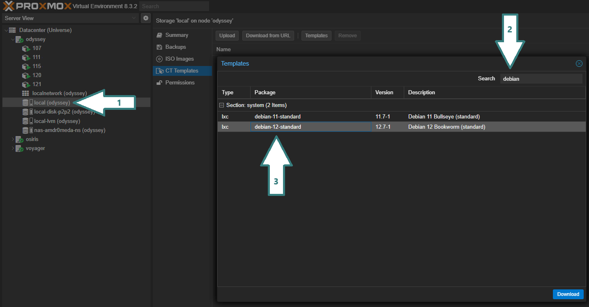

---
---
## 1º Crear un contenedor LXC en Proxmox
Si no tienes una imagen ya descargada de **Debían 12** descargarnos está desde el menú de templates (ver imagen) y posteriormente la usamos en el menú de creación del contenedor.


<p align="center">Imagen 1: (Ruta para descargar un template en este caso de Debian 12)<p>
<br>

Requerimientos mminimos:
-  **1GB** RAM
-  **1** Nucleo
-  **4GB** Almacenamiento
- IP estática (fuera del DHCP del router).<br><br>

>**Nota:** Si se dispone de **IPV6** por parte del ISP también se debe configurar para que el router le entregue una dirección.

<br>

1. Actualizaciones iniciales 
Procedemos a actualizar el contenedor con el siguiente comando:

   ```Apt update & upgrade```
# (ARTICULO EN PROCESO)

---
>*Saludos, amdr0meda*