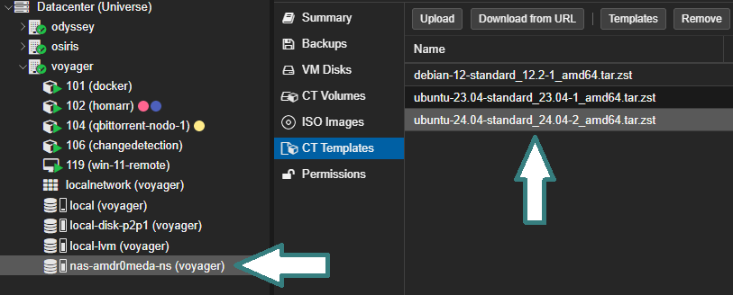

 

## 1º Crear un contendedor

Se  usa un template de ubuntu, en mi caso __ubuntu-24.04-standard_24.04-2_amd64.tar.zst__. Para descargar el template se debe realizar desde la pestaña "CT Templates" de tu unidad, en mi caso nas-amdr0meda-ns. Seleccionando el botón **Templates** y proceder a descargar.
  
