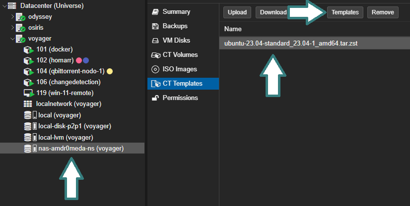
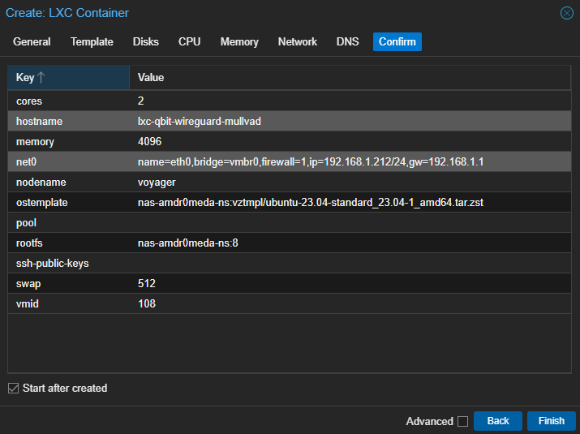
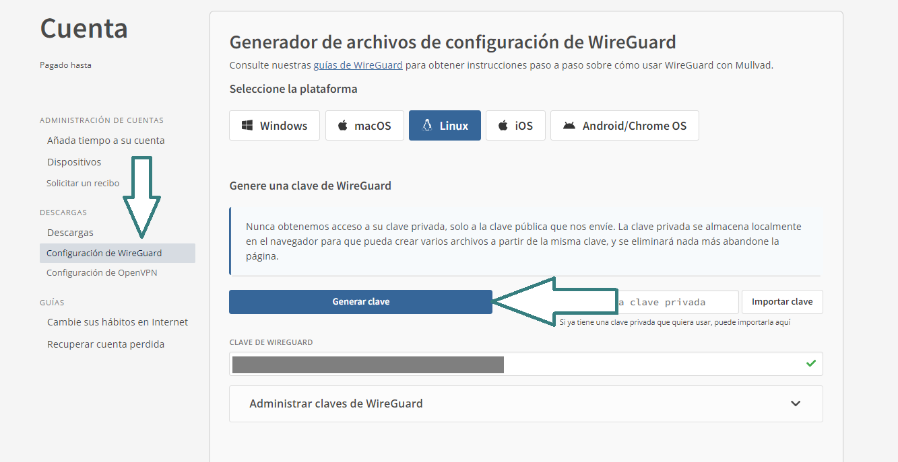
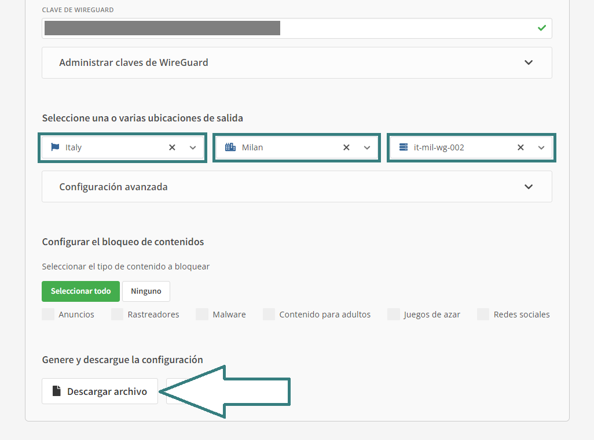
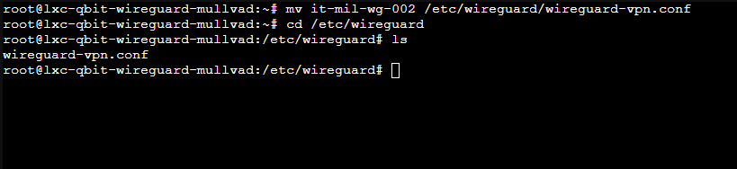
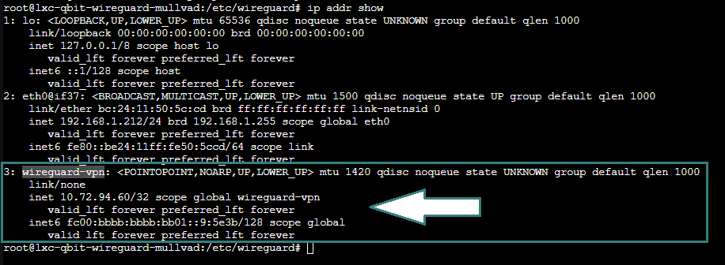
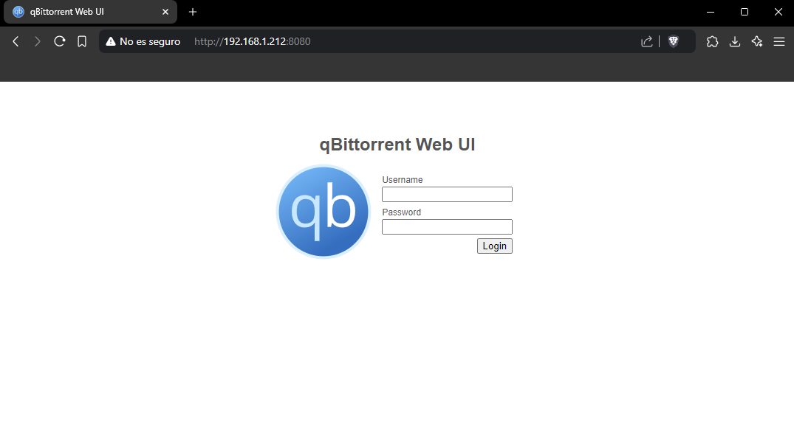
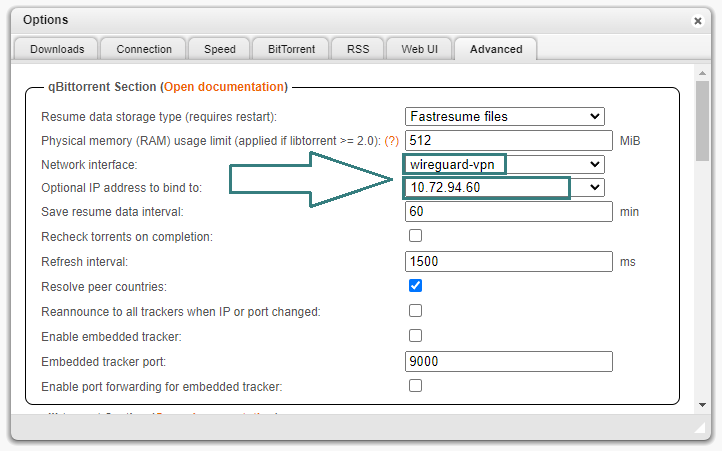

<br>

## 1º Crear un contendedor

Se  usará un template de ubuntu 23.04,  __ubuntu-23.04-standard_23.04-1_amd64.tar.zst__. Para descargar el template se debe realizar desde la pestaña "CT Templates" de tu unidad, en mi caso nas-amdr0meda-ns. Seleccionando el botón **Templates** y proceder a descargar.
<br><br>

<br><br>
Posteriormente creamos un contenedor LXC usando el template anterior, en mi caso con 2 nucleos, 4Gb de ram y 512Mb swap. Desmarcando que sea un contenedor sin privilegios para tener acceso completo de escritura, (si posteriormente queremos compartir via SAMBA los ficheros).



- Nota: En el ejemplo se asgina una IP fija (192.168.1.212). __Es recomendable asignar una IP fija al contenedor__.

<br><br>
## 2º Configuración inicial del contenedor

Ahora ya podemos iniciar el contenedor y conectarnos por consola. Nos autenticamos con el usuario --root-- y la clave que hemos asignado anteriormente. 

Antes de seguir con los proximos pasos debemos de actualizar todos los paquetes con el siguiente comando:
```
apt update && apt upgrade -y
```

Posteriormente necesitamos instalar wireguard, las herramientas de Wireguard, curl, qbittorrent-nox, cifs-utils y iftop.
```
apt install wireguard wireguard-tools curl qbittorrent-nox cifs-utils iftop

```

Ahora que ya tenemos instalado cifs-utils podemos o bien montar un recurso compartido donde se guardarán las descargas, como puede ser un NAS u omitir este paso y usar el almacenamiento de la maquina.

Si queremos configurar el almacenamiento compartido se hace como cualquier otro en el siguiente archivo (Necesario reiniciar el contenedor al finalizar):
```
nano /etc/fstab
```
<br><br>
## 3º Configuración del tunel VPN (Mullvad)
En este punto yo uso el proveedor de servicio VPN Mullvad, la configuración es independiente del proveedor, lo unico diferente es la forma de conseguir los datos necesarios, en el caso de Mullvad.

En su web nos ubicamos en __"Configuración de WireGuard"__ y ahcemos clic en "Generar clave":
<br><br>

<br><br>
Y desplazandose hacia abajo seleccionamos el pais, ciudad y servidor. Para finalizar descargamos el fichero y lo guardamos.
<br><br>



Ahora mueve el fichero de configuración a la maquina y dejalo en la ruta /etc/wireguard/ con el siguiente comando:
```
mv FICHERO_DESCARGADO.conf /etc/wireguard/wireguard-vpn.conf
```


(En mi caso el fichero se llama __it-mil-wg-002__)
<br><br>
## 4º Validación del tunel e inicio automatico

Iniciamos el tunel con:
```
wg-quick up wireguard-vpn
```

Para validar que la interfaz esta levantada y funcionando escribimos ``ìp addr show``.


Con el siguiente comando nos aseguramos de que se vuelva a conectar automaticamente cada vez que se incie el contenedor:
```
systemctl enable wg-quick@wireguard-vpn
```
<br><br>

## 5º Configuración de Qbittorrent (Nox)

Se ha instalado la versión sin interfaz grafica, la gestión se realizará desde el entorno web pero antes tambien tenemos que crear una tarea en el gestor de servicios para que inicie qBittorent con cada encendido para eso creamos el siguiente archivo:
```
nano /etc/systemd/system/qbittorrent-nox.service
```

Y dentro escribimos el siguiente codigo (Estamos escribiendo las configuraciones necesarias para indicar que se ejecute el servicio "abittorrent-nox"):
```
[Unit]
Description=servicio_qbittorrent
Documentation=man:qbittorrent-nox(1)
Wants=network-online.target
After=network-online.target nss-lookup.target

[Service]
Type=exec
ExecStart=/usr/bin/qbittorrent-nox

[Install]
WantedBy=multi-user.target
```


Ahora habilitamos el servicio para luego reiniciar el host y verificar su adecuado funcionamiento.
```
systemctl enable qbittorrent-nox && reboot
```

- (Nota: Con && concatenas comandos como en el ejemplo anterior)
<br><br>

## 6º Vinculación de la interfaz VPN (Wireguard) con Qbittorrent

Si todo ha ido bien debemos de poder acceder a la interfaz web de qBittorrent desde la IP de la maquina por el puerto :8080
``http://192.168.1.212:8080``



El usuario por defecto es ``admin`` y la clave ``adminadmin``. Es __altamente recomendable__ cambiar estas credenciales después del primer uso.
<br><br>

Abriendo la configuración y desplazandonos hasta __"Advanced"__ seleccionamos la interfaz de red del tunel VPN y en dirección IP la que nos facilita dicho tunel.

De esta manera finalizamos la configuración basica. A partir de ahora todos los torrents/magnets que descarguemos será a traves del tunel VPN.


<br><br>
Y eso es todo, ¡ahora puedes descargar tus torrents desde un pequeño contenedor, solo necesitas acceder via web a la interfaz y escribir tus magnets o adjuntar los .torrents y qBittorrent se encargará de descargarlos por la vpn!
<br><br><br><br>
*Saludos, amdr0meda*